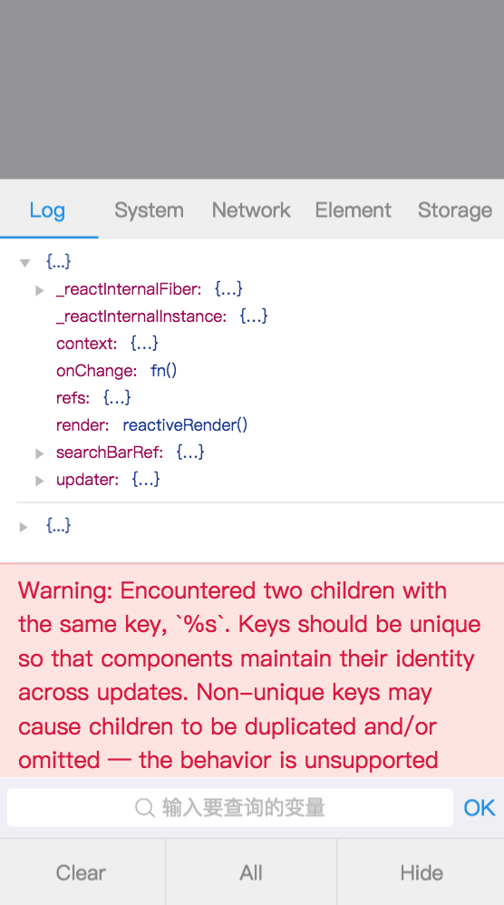
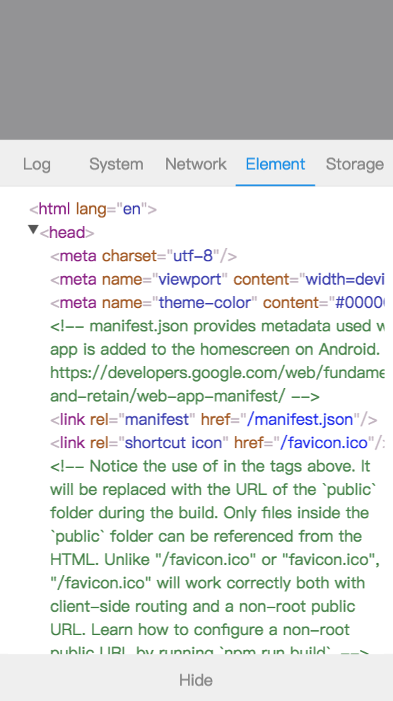

## myConsole

基于 Typescript + React + Mobx
实现的移动端前端调试控制台，仅供学习使用，谢谢！

## 特性

- Log & System
- Network
- Element
- Cookies & localStorage

## 预览

<p>
    
    
</p>

## 开始

本项目由 [Create React App](https://github.com/facebookincubator/create-react-app) 脚手架搭建。

```
yarn

yarn run start

```

## 教程

参见 [ts+react+mobx 实现移动端浏览器控制台](./doc/index.md)

## 参考

- [create-react-app](https://github.com/facebookincubator/create-react-app)
- [vConsole](https://github.com/Tencent/vConsole)
- [react-devtools](https://github.com/facebook/react-devtools)
