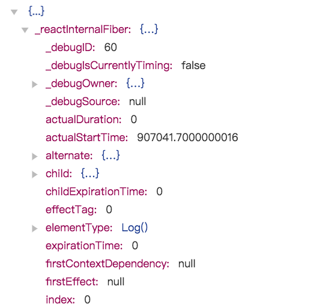
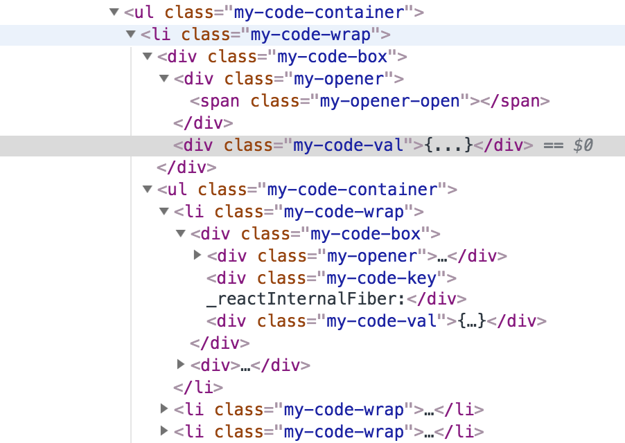

# Ts + React + Mobx 实现移动端浏览器控制台

自从使用 Typescript 写 H5 小游戏后，就对 Ts 产生了依赖（智能提示以及友好的重构提示），但对于其 **Type System** 还需要更多的实践。

最近开发 H5 小游戏，在移动端调试方面，为求方便没有采用 inspect 的模式。用的是粗暴的 [vConsole](https://github.com/Tencent/vConsole)，用人家东西要学会感恩，所以决定去了解它的原理，最后用 Ts + React 码一个**移动端浏览器控制台**，算是 **Ts + React 实战**。

通过该教程可以学习：

- **Ts + React + Mobx 开发流程**
- 基本的 Type System
- 一些 JavaScript 基础概念
- 浏览器控制台相关知识
  - Console
  - NetWork、XHR
  - Storage
  - **DevTool 核心渲染代码**

## 开始

本着快速开发的理念（本人要带娃），于是基于 [Create React App](https://github.com/facebookincubator/create-react-app) 脚手架搭建项目，UI 框架使用了同样采用
Ts 编写的 [AntMobile](https://github.com/ant-design/ant-design-mobile/)。 开始项目讲解前，显然需要对这两个有一定的了解 ( 建议可作为进一步学习 Ts + React 的参考 )

下面，先来看下预览图片


UI 很简单，按功能划分为

- Log 、 System
- Network
- Elemnet
- Storage

**主要从以上这几个功能模块展开**

<small> PS: 教程会略过一些，诸如如何支持 stylus （ 项目执行过 npm run eject ），interface 要不要加 I，render 要不要 Public， 如何去除一些 Tslint 等。（ 跟踪文件 git history 可略知一二 ）</small>

## 基本代码风格

通篇会按这种风格 ( 并不是最佳实践 ) 去编写组件，（ 比较少无状态组件，也没有高阶组件的应用 ）。

```ts
import React, { Component } from 'react';

interface Props {
  // props type here
}

interface State {
  // state type here
}

export default class ClassName extends Component<Props, State> {

  // state: State = {...}; 我更喜欢将 state 写在这。

  constructor(props: Props) {
    super(props);
    this.state = {
      // some state
    };
  }

  // some methods...

  render(){
    // return
  }
}
```

## Log

调试控制台最常用是 Log，与之不可分割的 API 就是 `window.console` 。常用的方法有`['log', 'info', 'warn', 'debug', 'error']`。UI 表现上可分为 Log，Warn，Error 三类。

**如何自己实现一个控制台 `console` 面板呢？** 其实很简单，只需要 “重写” `window.console` 对应的这些方法，然后再调用系统自带的 `console` 方法即可。这样你就可以实现在原有方法基础上附加一些你想要的操作。（ 可惜这么做会有一些副作用，后面会讲到。 ）

代码逻辑如下：

```ts
const methodList = ['log', 'info', 'warn', 'debug', 'error'];

methodList.map(method => {
  // 1. 保存 window 自带 console 方法。
  this.console[method] = window.console[method];
});

methodList.map(method => {
  window.console[method] = (...args: any[]) => {
    // 2. 做一些保存数据及展示的操作。

    // 3. 调用原生 console 方法。
    this.console[method].apply(window.console, infos);
  };
});

```

由于项目我们用的是 React ，由于是数据驱动，所以只需要关心数据即可。

在 Log 中的数据，其实就是 `console.log(参数)` 中的参数，再将这些参数用 mobx 以数组的形式统一管理后交由 List 组件渲染。

```ts
import { observable, action, computed } from 'mobx';

export interface LogType {
  logType: string;
  infos: any[]; // 来自 console 方法的参数。
}

export class LogStore {
  @observable logList: LogType[] = [];
  @observable logType: string = 'All';

  // some action...
}

export default new LogStore()

```

数据和列表展示都有了，那么 **如何用树形结构展示基本数据类型与引用类型**

基本类型 ( undefined，null，string，number，boolean，symbol )展示比较简单，这边讲一下引用类型 （ Array，Object ）的展示实现。对应项目中就是 `logView` 组件。

### logView 组件

从之前的预览图片可以大致看到整个数据展示结构，都是 key-value 的形式。



这里跟Pc 端浏览器控制台不一样的是，没有展示 `__proto__` 相关的东西。然后，`function` 只是以方法名加括号的形式展示，如 `log()`。

接下来我们看下这个 UI 对应的 html 结构。



我们需要展示的就只是 key 和 value 以及父子缩进，典型的树形结构，递归可以搞定。

对于 `Object` 直接就是 `key-value` 而 `Array` 其实也是索引和值得对应关系。

基本逻辑：

```jsx
<li className="my-code-wrap">
  <div className="my-code-box">
    // 1. 判断是否需要显示展开图标
    {opener}
    <div className="my-code-key">
      // 2. 显示 key
      {name}
    </div>
    <div className="my-code-val">
      // 3. 根据值类型，选择其展示方式
      {preview}
    </div>
  </div>
  // 4. 如果是 Object 或 Array，则重复 1.
  {children}
</li>
```

至此一个简单的 log 面板就完成了。
